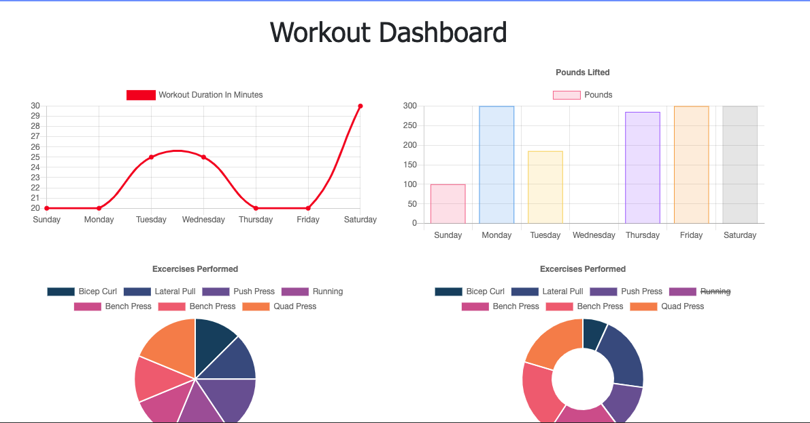

# Workout-Tracker

## Table of Contents
* Description
* Production Team
* How to Use
* Demo Link
* Screenshot
* Additional Questions   

## Description 
An app designed to track your daily workouts. You will be able to log multiple exercises in a workout on a given day. You'll also be able to track the name, type, weight, sets, reps and duration of exercise. You can also track the distance for a given cardio exercise. 

## Production Team
* [Justin Yocus](https://github.com/jyocus)

## How to Use
When the web page loads you can navigate to either a new workout or continue an old one. 

## Demo Links 
[Heroku](https://desolate-stream-71272.herokuapp.com)

[Github](https://github.com/jyocus/Workout-Tracker)

## Screenshot

## Additional Questions
If you have any questions about the project or would like to contact me, please reach out through GitHub.